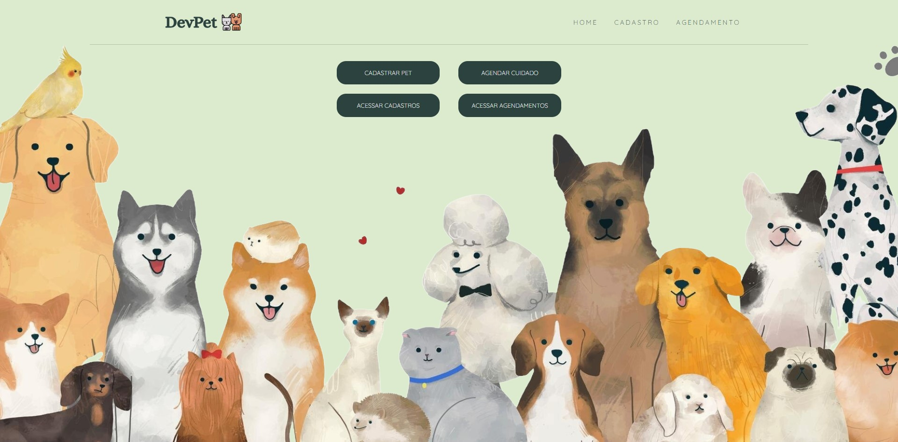
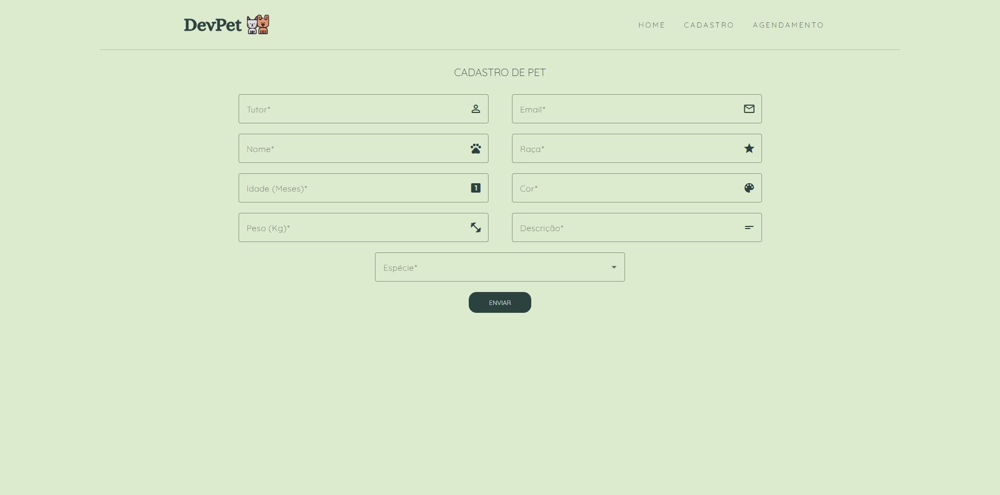
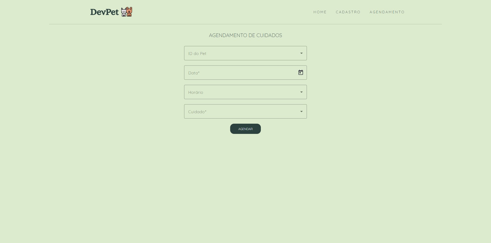
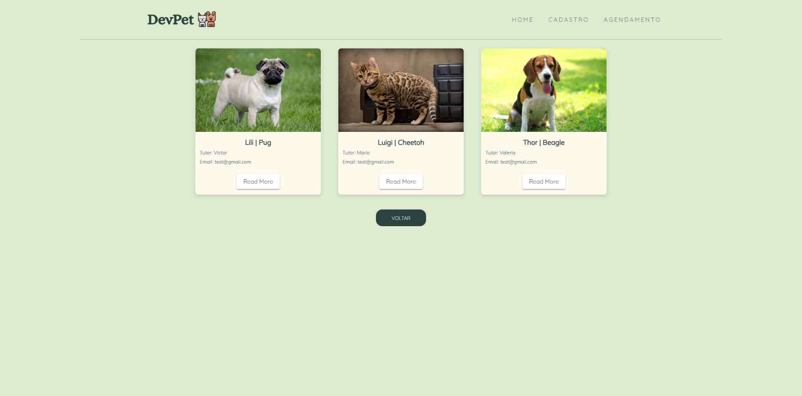
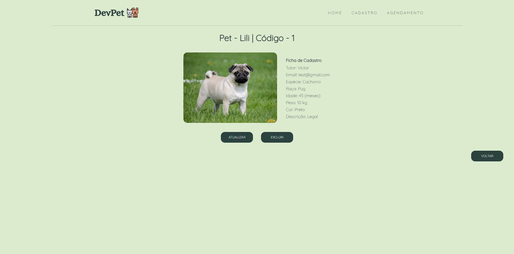
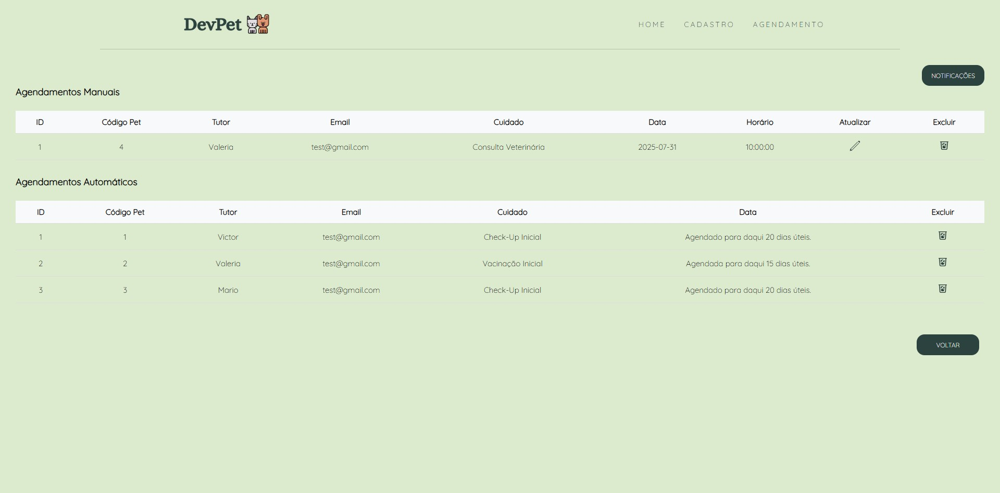

<h2 style="text-align: center">DevPet - Desenvolvendo seu Pet com os melhores cuidados!</h2>

O <b>DevPet</b> é um sistema desenvolvido com objetivo de gerenciar pets e os cuidados necessários para o desenvolvimento do seu melhor amigo. Ele possibilita realizar o cadastro de pets e o agendamento de cuidados, enviando notificações via email para seus tutores.

<h2>Sumário</h2>
  <ol>
    <li><a href="#pages">Páginas e Funcionalidades</a></li>
    <li><a href="#api">Integração com API</a></li>
    <li><a href="#tech">Tecnologias Utilizadas</a></li>
    <li><a href="#exec">Como Executar o Projeto</a></li>
  </ol>

<h2 id="pages">Páginas e Funcionalidades</h2>

🏠 <b>Home: </b> Página principal que introduz os serviços oferecidos, contendo botões para realização de cada ação.

<i>Tela Inicial</i>

🐶 <b>Cadastro: </b> Página com formulário para realização de cadastro do Pet.

<i>Tela de Cadastro</i>

🕗 <b>Agendamento: </b> Página com formulário para realização de agendamento de cuidado.

<i>Tela de Agendamento</i>

🐱 <b>Acesso Cadastros: </b> Página que apresenta todos os pets cadastrados, permitindo ver mais detalhes do pet, além da possibilidade de alterar ou excluir um cadastro.

<i>Tela de Listagem de Pets</i>

<i>Tela de Detalhes do Pet</i>

📑 <b>Acesso Agendamentos: </b> Página que apresenta todos os agendamentos realizados, permitindo alterar ou excluir um agendamento. Além disso, a página também introduz um botão de "notificações", que permite visualizar as notificações enviadas aos tutores via email.

<i>Tela de Listagem de Agendamentos</i>

<h2 id="api">Integração com API</h2>

O sistema foi integrado ao microsserviço desenvolvido anteriormente, que contém o CRUD e toda a lógica de aplicação de cadastros e agendamentos, bem como, o consumo das APIs externas <a href="https://www.thedogapi.com/" target="blank">The Dog API</a> e <a href="https://www.thecatapi.com/" target="blank">The Cat API</a>.

<h2 id="tech">Tecnologias Utilizadas</h2>

📌 <b>Angular:</b> Framework desenvolvido pelo Google utilizado para construção de interfaces de usuário modernas e dinâmicas, que tem como base o TypeScript.

📌 <b>Angular Material:</b> Biblioteca de componentes de interface do usuário pré-construídos.

📌 <b>Java:</b> Linguagem de programação utilizada para desenvolver o backend da aplicação.

<h2 id="exec">Como Executar o Projeto</h2>

<b>1.</b> Clone o projeto;

<b>2.</b> Execute todos os microsserviços do backend;

<b>3.</b> Com o docker rodando, execute o RabbitMQ através do comando: <i><b>docker compose up</b></i>;

<b>4.</b> Posteriormente, execute o frontend no terminal com o comando: <i><b>npm start</b></i>;

<b>5.</b> Por fim, acesse através do seguinte endereço: <i><b>http://localhost:4200</b></i>.
